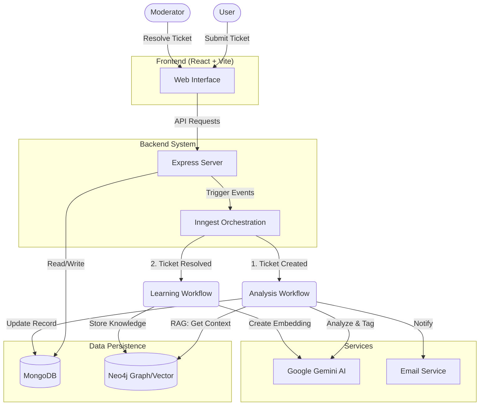

# AI Smart Support Ticketing System with GraphRAG 🧠

A next-generation support ticket management system that uses **Autonomous AI Agents** and **Graph Retrieval Augmented Generation (GraphRAG)** to categorize, route, and solve support tickets automatically.

## 🚀 Key Features

- **AI-Powered Triage**: Google Gemini analyzes incoming tickets to determine Priority, Status, and Required Skills.
- **GraphRAG (Self-Learning)**: Uses **Neo4j** to store "Resolved" tickets as vector embeddings. When a new ticket arrives, the system searches the Knowledge Graph for similar past solutions and auto-suggests fixes.
- **Smart Assignment**: Auto-assigns tickets to moderators based on matching skills (e.g., matching a "React" ticket to a React expert).
- **Event-Driven Workflows**: Built on **Inngest** for reliable, serverless-style background functions (Retries, Sleep, Fan-out).
- **Role-Based Access**: Granular permissions for Users, Moderators, and Admins.

## 🛠️ Tech Stack

- **Frontend**: React + Vite (TailwindCSS + DaisyUI)
- **Backend**: Node.js + Express
- **Database**: MongoDB (Metadata) + Neo4j (Vector & Knowledge Graph)
- **AI & Orchestration**: Google Gemini + Inngest
- **Auth**: JWT

## 🏗️ System Architecture



## 📦 Setup & Installation

### Prerequisites
- Node.js (v18+)
- MongoDB URI
- Neo4j Aura Instance (URI/User/Password)
- Google Gemini API Key

### 1. Backend Setup
```bash
cd Backend
npm install
# Create a .env file with your credentials (PORT, MONGO_URI, GEMINI_API_KEY, NEO4J_URI, etc.)
npm run dev
```

**Start Inngest Dev Server (in a separate terminal):**
```bash
cd Backend
npm run inngest-dev
```

### 2. Frontend Setup
```bash
cd Frontend
npm install
npm run dev
```

## 🧠 GraphRAG Workflow

1. **Ingestion**: When a moderator marks a ticket as **RESOLVED**, the `on-ticket-resolved` workflow generates a vector embedding of the solution and stores it in Neo4j.
2. **Retrieval**: When a **new ticket** is created, the system queries Neo4j for semantically similar past tickets.
3. **Generation**: The AI uses the retrieved historical context to generate `Helpful Notes` for the moderator, effectively "remembering" how to solve recurring issues.
